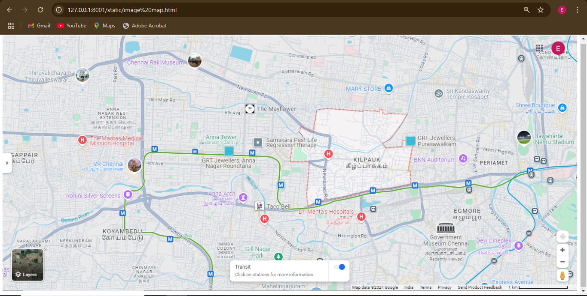
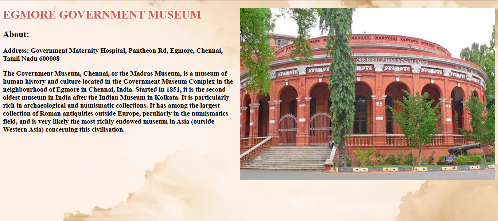

# Ex04 Places Around Me
# Date:7-10-2024
# AIM
To develop a website to display details about the places around my house.

# DESIGN STEPS
## STEP 1
Create a Django admin interface.

## STEP 2
Download your city map from Google.

## STEP 3
Using <map> tag name the map.

## STEP 4
Create clickable regions in the image using <area> tag.

## STEP 5
Write HTML programs for all the regions identified.

## STEP 6
Execute the programs and publish them.

# CODE
```
image map.html

 <!DOCTYPE html>
 <html lang="en">
 <head>
    <meta charset="UTF-8">
    <meta name="viewport" content="width=device-width, initial-scale=1.0">
    <title>Image map</title>
 </head>
 <body>
    
    <map name="mymap">
        <area shape="circle"  coords="452,57,98" href="museum.html" title="Chennai rail museum (ICF)"/>
        <area shape="rect" coords="177,279,346,363" href="vr.html"   title="VR Mall Chennai"/>
        <area shape="circle" coords="1067,486,103"  href="egmore museum.html"   title="Egmore Museum Chennai"/>
        <area shape="rect" coords="1189,210,1364,271"  href="stadium.html"   title="Jawaharlal Nehru Stadium"/>
        <area shape="circle" coords="186,87,80"  href="temple.html"   title="Thiruvalidhayam Thiruvaleeswarar Temple"/>
        <area shape="circle" coords="522,391,74"  href="anna arch.html"   title="Anna Arch"/>
        <area shape="circle" coords="506,233,70"  href="anna tower.html"   title="Anna Nagar Tower Park"/>
    </map>
    
 </body>
 </html>


museum.html

 <!DOCTYPE html>
 <html lang="en">
 <head>
  <meta charset="UTF-8">
  <meta name="viewport" content="width=device-width, initial-scale=1.0">
  <title>Chennai Rail Museum</title>
  <style type="text/css">

body{
        background-image: url(background.webp);
        background-repeat:no-repeat;
        background-attachment: fixed;
        background-size: 100%;
      }

    .img_deg{
      float:right
    }

    

  </style>
 </head>
 <body style="background-color: darksalmon;" >
   <h1 style="color:indianred">CHENNAI RAIL MUSEUM</h1>
   
   <h2 >About:</h2>
   <h3 >Address: Next to ICF Furnishing Division, New Avadi Rd, Lakshmipuram, Villivakkam, Chennai, Tamil Nadu 600038</h3>
   
   <h3 >The Chennai Rail Museum is a railway museum in Chennai, Tamil Nadu, India. The museum opened on 16 April 2002 in the Furnishing Division of the Integral Coach Factory (ICF) near Perambur. The 6.25-acre (2.53 ha) museum has technical and heritage exhibits, with a sizable collection of steam engines from the British Raj. It also has vintage coaches (such as Ooty trains), which were endemic on Indian railways. Most of the older models were manufactured by the North British Locomotive Company,[1] with some trains in the collection dating back more than a century</h3>
  
 </body>
 </html>

vr.html

  <!DOCTYPE html>
  <html lang="en">
  <head>
    <meta charset="UTF-8">
    <meta name="viewport" content="width=device-width, initial-scale=1.0">
    <title>VR CHENNAI</title>
    <style type="text/css">

      body{
        background-image: url(background.webp);
        background-repeat:no-repeat;
        background-attachment: fixed;
        background-size: 100%;
      }

        .img_deg{
          float:right
        }
        h1{
          color:indianred
        }

        </style>
  </head>
 

  <body style="background-color: darksalmon;">
    
    
    <h1>VR MALL CHENNAI</h1>
    <h2>About:</h2>
    <h3>Address:100 Feet Rd, Thirumangalam, Anna Nagar, Chennai, Tamil Nadu 600040</h3>
    
    <h3>VR Chennai (Tamil: வி. ஆர். சென்னை) is a shopping mall located on Jawaharlal Nehru Road in Anna Nagar West, Chennai, Tamil Nadu, India.[3] This mall was opened to the public on 18 June 2018.[1] It is one of the largest malls in Chennai by area, occupying 1,840,000 square feet (171,000 m2) built-up area with 1,000,000 square feet (93,000 m2) of retail space.[1][2]</h3>

    
  </body>
  </html>


temple.html

  <!DOCTYPE html>
<html lang="en">
<head>
 <meta charset="UTF-8">
 <meta name="viewport" content="width=device-width, initial-scale=1.0">
 <title>Tiruvalithayam_Tiruvallesvarar_Temple</title>
 <style type="text/css">

body{
       background-image: url(background.webp);
       background-repeat:no-repeat;
       background-attachment: fixed;
       background-size: 100%;
     }

   .img_deg{
     float:right
   }

   

 </style>
</head>
<body style="background-color: darksalmon;">
    
  <h1 style="color:indianred">Thiruvalidhayam Thiruvaleeswarar TEMPLE</h1>
  <h2 >About:</h2>
  <h3 >Address: 207/152, Raja St, Padi, Chennai, Tamil Nadu 600050</h3>
 
  <h3 >Tiruvalithayam Tiruvallesvarar Temple is a temple dedicated to the Hindu deity Shiva, located at Padi, a north-western neighbourhood of Chennai, India.[1] Shiva is worshiped as Tiruvalleswarar, and is represented by the lingam and his consort Parvati is depicted as Jagathambikai. The presiding deity is revered in the 7th-century Tamil Saiva canonical work, the Tevaram, written by Tamil poet saints known as the nayanars and classified as Paadal Petra Sthalam.</h3>
</body>
</html>

egmore museum.html

<!DOCTYPE html>
<html lang="en">
<head>
 <meta charset="UTF-8">
 <meta name="viewport" content="width=device-width, initial-scale=1.0">
 <title>EGMORE MUSEUM</title>
 <style type="text/css">

body{
       background-image: url(background.webp);
       background-repeat:no-repeat;
       background-attachment: fixed;
       background-size: 100%;
     }

   .img_deg{
     float:right
   }

   
 </style>
</head>
<body style="background-color: darksalmon;">
    
  <h1 style="color:indianred">EGMORE GOVERNMENT MUSEUM</h1>
  <h2 >About:</h2>
  <h3 >Address: Government Maternity Hospital, Pantheon Rd, Egmore, Chennai, Tamil Nadu 600008</h3>
  
  <h3 >The Government Museum, Chennai, or the Madras Museum, is a museum of human history and culture located in the Government Museum Complex in the neighbourhood of Egmore in Chennai, India. Started in 1851, it is the second oldest museum in India after the Indian Museum in Kolkata. It is particularly rich in archaeological and numismatic collections. It has among the largest collection of Roman antiquities outside Europe, peculiarly in the numismatics field, and is very likely the most richly endowed museum in Asia (outside Western Asia) concerning this civilisation.</h3>
</body>
</html>

anna tower.html

<!DOCTYPE html>
<html lang="en">
<head>
 <meta charset="UTF-8">
 <meta name="viewport" content="width=device-width, initial-scale=1.0">
 <title>Anna nagar tower park</title>
 <style type="text/css">

body{
       background-image: url(background.webp);
       background-repeat:no-repeat;
       background-attachment: fixed;
       background-size: 100%;
     }

   .img_deg{
     float:right
   }

  
 </style>
</head>
<body style="background-color: darksalmon;">
    
  <h1 style="color:indianred">ANNA NAGAR TOWER PARK</h1>
  <h2 >About:</h2>
  <h3 >Address: Anna Nagar 3rd Main Rd, X Block, Tower Park, Anna Nagar, Chennai, Tamil Nadu 600040</h3>
  <h3 >Anna Nagar Tower Park, officially known as Dr Visvesvaraya Tower Park, is an urban park in the suburb of Anna Nagar, Chennai. It hosts a 133 ft (41 m) tall watch tower, which was built in 1968 . A 133 ft (41 m) tower was constructed as a part of Indian International Trade and Industries Fair in 1968. The tower was inaugurated by then Vice-President of India V. V. Giri in the presence of the then Chief Minister of Tamil Nadu C. N. Annadurai on 21 January 1968.[1][2] It is named after engineer and administrator Visvesvaraya.</h3>
</body>
</html>

anna arch.html

<!DOCTYPE html>
<html lang="en">
<head>
 <meta charset="UTF-8">
 <meta name="viewport" content="width=device-width, initial-scale=1.0">
 <title>Anna Arch</title>
 <style type="text/css">

body{
       background-image: url(background.webp);
       background-repeat:no-repeat;
       background-attachment: fixed;
       background-size: 100%;
     }

   .img_deg{
     float:right
   }

  
 </style>
</head>
<body style="background-color: darksalmon;" >
    
  <h1 style="color:indianred">ANNA ARCH</h1>
  <h2 >About:</h2>
  <h3 >Address: Anna Arch Rd, NSK Nagar, Arumbakkam, Chennai, Tamil Nadu 600106</h3>
  <h3 >Anna Nagar twin arches are ornamental twin arches located in Anna Nagar, Chennai, India. It was built on 1 January 1986 to commemorate the platinum jubilee of the former Chief Minister of Tamil Nadu C. N. Annadurai.[1] Located at the junction of Poonamallee High Road and Anna Nagar Third Avenue, the arches are one of the most prominent landmarks in the city and serve as the entrance of the suburb of Anna Nagar from the southern side.The twin arches were built in 1985[2] by the Corporation of Madras to commemorate the platinum jubilee of the former Chief Minister of Tamil Nadu C. N. Annadurai. Built at a cost of ₹ 1.2 million,[3] the arches were completed in 105 days[4] and were inaugurated on 1 January 1986 by former Chief Minister M. G. Ramachandran.[1] The arches were designed by sculptor Ganapathy Sthapathi, who was honoured during the inauguration of the arches.</h3>
</body>
</html>

stadium.html

<!DOCTYPE html>
<html lang="en">
<head>
 <meta charset="UTF-8">
 <meta name="viewport" content="width=device-width, initial-scale=1.0">
 <title>Jawaharlal Nehru Stadium</title>
 <style type="text/css">

body{
       background-image: url(background.webp);
       background-repeat:no-repeat;
       background-attachment: fixed;
       background-size: 100%;
     }

   .img_deg{
     float:right
   }

   

 </style>
</head>
<body style="background-color: darksalmon;">
    
  <h1 style="color:indianred">Jawaharlal Nehru Stadium_</h1>
  <h2 >About:</h2>
  <h3 >Address: Raja Muthiah Rd, Periamet, Kannappar Thidal, Poongavanapuram, Chennai, Tamil Nadu 600003</h3>
  <h3 >The Marina Arena, also officially named as Jawaharlal Nehru Stadium is a multi-purpose stadium in Chennai, India.[1] It has a capacity of 40,000.[2] It mostly hosts football matches and athletic competitions. The complex also houses an indoor stadium with a seating capacity of 5,000 which hosts volleyball, basketball, and table tennis games. The stadium is also used for functions and concerts. The stadium is named after Jawaharlal Nehru, India's first Prime Minister. It was known as the Corporation Stadium till the 1980s. The stadium earlier hosted cricket Test matches between 1956 and 1965.[3] As of 19 August 2017, it has hosted 9 Tests.</h3>
</body>
</html>

 
```
# OUTPUT






# RESULT
The program for implementing image maps using HTML is executed successfully.
